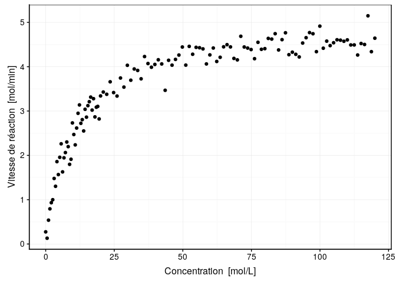

Vitesse de réaction chimique
================

``` r
knitr::opts_chunk$set(echo = TRUE)
SciViews::R
```

    ## ── Attaching packages ─────────────────────────────────────────────────────────── SciViews::R 1.1.0 ──

    ## ✔ SciViews  1.1.0        ✔ purrr     0.3.2   
    ## ✔ chart     1.3.0        ✔ readr     1.3.1   
    ## ✔ flow      1.0.0        ✔ tidyr     0.8.3   
    ## ✔ data.io   1.2.2        ✔ tibble    2.1.1   
    ## ✔ svMisc    1.1.0        ✔ ggplot2   3.1.1   
    ## ✔ forcats   0.4.0        ✔ tidyverse 1.2.1   
    ## ✔ stringr   1.4.0        ✔ lattice   0.20.38 
    ## ✔ dplyr     0.8.0.1      ✔ MASS      7.3.51.3

    ## ── Conflicts ──────────────────────────────────────────────────────────────── tidyverse_conflicts() ──
    ## ✖ dplyr::filter() masks stats::filter()
    ## ✖ dplyr::lag()    masks stats::lag()
    ## ✖ dplyr::select() masks MASS::select()

## Contexte

``` r
speed <- read("data/reaction.rds")
```

Des scientifiques ont déterminé la vitesse d’une réaction chimique en
fonction de la concentration en substrat. Le jeu de données mis à votre
disposition est détaillé ci-dessous.

``` r
skimr::skim(speed)
```

    ## Skim summary statistics
    ##  n obs: 120 
    ##  n variables: 2 
    ## 
    ## ── Variable type:numeric ─────────────────────────────────────────────────────────────────────────────
    ##  variable missing complete   n  mean    sd   p0   p25   p50   p75   p100
    ##      conc       0      120 120 50.33 37.35 0    15.26 45.44 82.72 120   
    ##     speed       0      120 120  3.6   1.14 0.13  3     4.09  4.44   5.15
    ##      hist
    ##  ▇▅▃▃▃▃▃▃
    ##  ▁▁▁▁▂▂▇▃

Les scientifiques ont réalisé le graphique ci-dessous qui sera la base
de votre recherche. Les scientifiques ont besoin de vous afin de
réaliser une régression non linéaire.

``` r
chart(speed, speed ~ conc) +
  geom_point()
```

<!-- -->

## Objectif

Dans le cadre de cet exercice, vous devez réaliser un document au format
Rmd pour analyser la situation mise à votre disposition sous la forme
d’un carnet de laboratoire.

Afin de cadrer votre recherche, tentez de réaliser une régression non
linéaire qui suit l’équation proposée par Michaelis-Menten dont
l’équation est la suivante :

La courbe de Michaelis-Menten est bien connue pour modéliser des
cinétiques chimiques simples, enzymatiques en particulier. Son équation
est :

\[V = \frac{V_{max} * conc}{K + conc}\]

où \(conc\) est la concentration des réactifs au début de la réaction,
c’est-à-dire, en absence de produits de cette réaction en mol/L, \(V\)
est la vitesse de réaction en mol/min. Le modèle a deux paramètres
\(V_{max}\) la vitesse maximale asymptotique en mol/min et \(K\) en
mol/L correspondant à la concentration telle que la vitesse est la
moitié de \(V_{max}\).

Votre carnet de laboratoire doit débuter par une introduction sur
l’équation de Michaelis-Menten. Ensuite, vous devez décrire la suite
des opérations que vous allez réaliser
